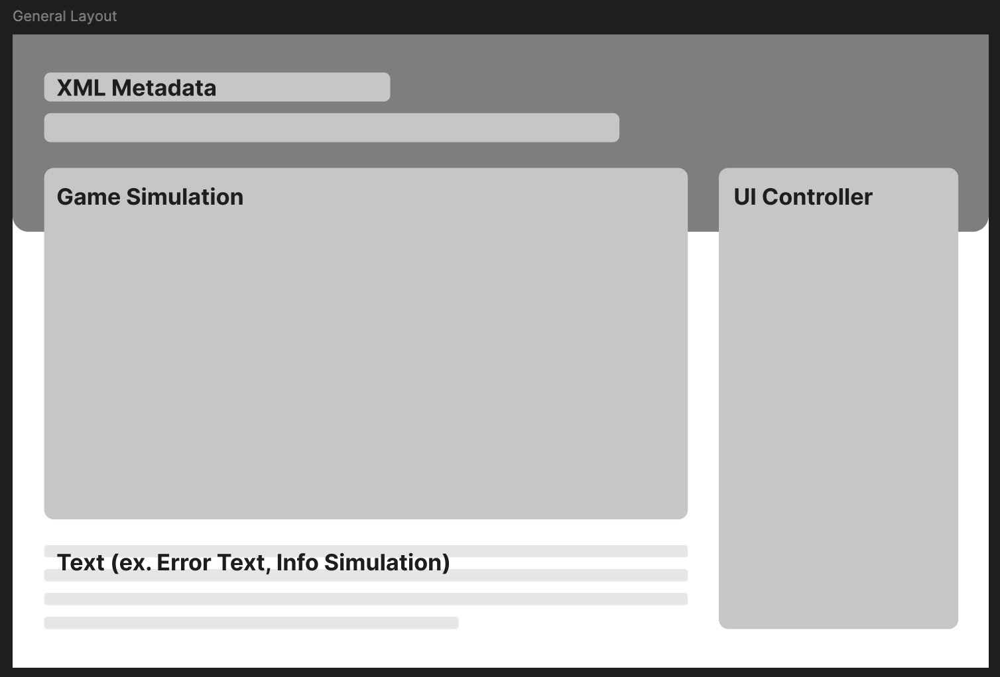
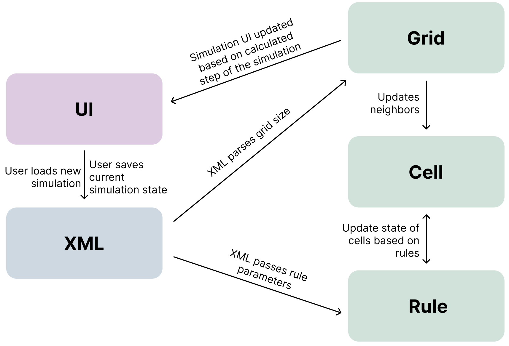

# Cell Society Design Plan  
### Team 3  
- Kyaira Boughton (keb125)
- Jessica Chen (jc939)
- Calvin Chen (clc162)

## Overview  

The problem statement this program seeks to address is how to simulate various cellular automata. The primary design goals of this program is to provide a flexible and easily extendable framework for defining, running, and displaying different types of simulation. Thus, we will have a focus on encapsulation such that each component manages its own logic interdependently promoting the ideas of modularity for easy maintainability.

Thus, the primary architecture will focus on a layered communication model where the GUI, XML, and Simulation modules have defined public interfaces for interaction. Their internal logic will remain private hiding the underlying datastructures. Furthermore, users will interact solely through the GUI which will coordinate with the XML and Simulation modules to manage configuration and calculation of the simulation.

## User Interface



## Configuration File Format

```  
<simulation>  
    <metadata>  
        <type>Game of Life</type>  
        <title>Life Simulation 1<title>  
        <author>Robert C. Duvall</author>  
        <description>This is my first Game of Life simulation!</description>  
    </metadata>  
      
    <grid rows="2" columns="2">  
        <cell row="0" col="0" state="alive"/>  
        <cell row="0" col="1" state="dead"/>  
        <cell row="1" col="0" state="alive"/>  
        <cell row="1" col="1" state="alive"/>  
    </grid>  
      
    <parameters>  
        <!-- This is the parameter values -->  
    </parameters>  
</simulation>  
```

```  
<simulation>  
    <metadata>  
        <type>Spreading of Fire</type>  
        <title>Fire Sim<title>  
        <author>Vincent Price</author>  
        <description>This simulation is fire</description>  
    </metadata>  
      
    <grid rows="2" columns="2">  
        <cell row="0" col="0" state="burning"/>  
        <cell row="0" col="1" state="tree"/>  
        <cell row="1" col="0" state="empty"/>  
        <cell row="1" col="1" state="tree"/>  
    </grid>  
      
    <parameters>  
        <ignitionLikelihood>0.5</ignitionLikelihood>  
    </parameters>  
</simulation>  
```

## Design Overview
* Cell  
  * the smallest unit of the simulation that stores its state and neighbors
  * abstract class with simulation type specific subclasses
* Rules  
  * encapsulates logic for transitioning between cell states
  * abstract class with simulation type specific subclasses
* Grid  
  * abstraction for the cell location and management
  * coordinates state updates throughout the cells
* XML  
  * All methods related to XML, such as saving a current configuration, loading a new configuration, and overwriting an existing file (if applicable).  
* GUI  
  * user interface for controlling the simulation and interacting with files
  * visual representation of simulation and information



## Design Details  

### XML
**XML Parser**
- loadConfig(File file): loads a simulation configuration and initializes the simulation with the correct values
- saveConfig(): saves the current simulation state
- overwriteConfig(): Updates an existing configuration file
  - for save and overwrite the parameters passed in should be the metadata / file save location users can update 

### UI
**Button**
- buttons for start, pause, load, save, reset, changeSimulationSpeed
- something like onButtonClick(String action)

**Grid Display**
- renderGrid(Grid grid): update visual representation of the grid

**Text Display**
- loadMessage(String): updates message to message in string

### Simulation
**Grid**
- initializeGrid(int rows, int columns): creates a grid of cells
- updateNeighbors(): updates each cell with its neighbors based on the grid 
- stepAllCells(): triggers state calculation and updates state for all cells for each simulation step
- getCell(int x, int y): returns the cell at x, y
- setCell(int x, int y, State): sets the cell at x, y to state

**Cell**
- getState(): returns the current state 
- setState(State state): updates the state of the cell
- getNeighbors(): return the neighbors of the cell
- setNeighbors(List<Cell> neighbors): updates the neighbors of the cell
- calculateNextState(List<Cell> neighbors): determines the next state using Rules

**Rule**
- updateParameters(): updates parameters based on parameters for each simulation
- calculateState(Cell cell, List<Cell> neighbors): returns the new state of a cell based on simulation rules

> - this flow allows for the handling of the functional requirements as seen later in use cases
> - furthermore, it hides details of implementation as since we are abstracting how the cells are stored into Grid, and grid serves as the point of which cells are wear, it does not matter to any other class if grid is given in the form of an array list or a hashmap (etc.)
> - additionally, since XML does the parsing and passes into Grid and Rule the actual value not its format, if there was a JSON parser instead, Grid and Cell would not care

## Design Considerations  
*This section justifies your team's reasoning for the classes and methods given in the design, including alternatives considered with pros and cons from all sides of the discussion. Describe in detail at least two design issues your group discussed at length (even if you have not yet resolved it), including pros and cons from all sides of the discussion and the alternate design options considered.*

One of the design issues is if the responsibility for managing cell neighbors is managed by Grid or individual Cell instances.

- Grid calculates neighbors dynamically during each simulation step by iterating through the grid structure
  - pros
    - reduces memory usage since neighbors are not stored persistently in each cell
  - cons
    - increased computational overhead, as neighbor relationships must be recalculated on every simulation step
- Each Cell stores references to its neighbors, which are updated whenever the grid changes
  - pros
    - reduces computational overhead during simulation steps, as neighbors are precomputed
  - cons
    - higher memory usage due to storage of neighbor references in every cell
    - additional complexity when the grid size changes, requiring neighbor references to be updated

The next design issue is which class should coordinate interactions between the GUI, Simulation, and XML components.

- dedicated MainController class that manages all interactions to act as an intermediary between components
    - pros
        - clear separation of concerns to minimizing the direct dependencies between the modules
        - makes the system more modular and easier to debug or extend especially if you needed more components
    - cons
        - adds an extra layer of complexity which makes the design harder to understand how the components interact and are called
- Simulation/GUI as the MainController
    - pros
        - aligns with some part of the role of GUI / Simulation since both heavily relay on the other two components
    - cons
        - creates a tight coupling between them and other components which might reduce modularity and violate responsibility principles

## Use Cases  

### Given Cases

Apply the rules to a middle cell: set the next state of a cell to dead by counting its number of neighbors using the Game of Life rules for a cell in the middle (i.e., with all its neighbors)
```java
// assuming we already are in a game
GameOfLifeCell middleCell;
List<Cell> neighbors = middleCell.getNeighbors();
State nextState = rule.calculateState(middleCell, neighbors);

middleCell.setState(nextState); 
```

Apply the rules to an edge cell: set the next state of a cell to live by counting its number of neighbors using the Game of Life rules for a cell on the edge (i.e., with some of its neighbors missing)
```java
// assuming we already are in a game
GameOfLifeCell edgeCell;
List<Cell> neighbors = edgeCell.getNeighbors();
State nextState = rule.calculateState(edgeCell, neighbors);

edgeCell.setState(nextState); 
```

Move to the next generation: update all cells in a simulation from their current state to their next state and display the result graphically
```java
grid.stepAllCells(); 
ui.renderGrid(grid); 
```

Switch simulations: load a new simulation from a data file, replacing the current running simulation with the newly loaded one
```java
Grid newGrid;
Rule newRule;

XMLParser parser = new XMLParser();
parser.loadConfig(newConfigFile);   // load config initializes newGrid and new Rule with initial parameters

ui.renderGrid(newGrid);
```

Set a simulation parameter: set the value of a parameter, probCatch, for a simulation, Fire, based on the value given in a data file
```java
Grid newGrid;
Rule newRule;

XMLParser parser = new XMLParser();
parser.loadConfig(newConfigFile);   // load config initializes newGrid and new Rule with initial parameters, parameters handled here

ui.renderGrid(newGrid);
```

### Additional Cases

Saves the current simulation state to a new file
```java
ui.onButtonClick(save);

// ButtonClick then calls 
parser.saveConfig(filePath);
```
Updates an existing configuration file with current simulation data
```java
ui.onButtonClick(save);

// ButtonClick then calls 
parser.overwriteConfig(filePath);
```

Load incorrect simulation file
```angular2html
parser.loadConfig(filePath);
// loadConfig checks if valid file, if not returns with an error signal to UI

ui.loadMessage(incorrect simulation string);  // where the string is found in the constants
```

Update the metadata of a simulation file for save
```java
ui.onButtonClick(save);

// ButtonClick then calls 
parser.saveConfig(filePath, metadata);  // if metadata from default add as parameters
```

Apply rules to a middle cell for WaTor World  
```java
// assuming we already are in a game
WaTorWorldCell middleCell;
List<Cell> neighbors = middleCell.getNeighbors();
State nextState = rule.calculateState(middleCell, neighbors);

middleCell.setState(nextState); 
```

Apply the rules to an edge cell WaTor World
```java
// assuming we already are in a game
WaTorWorldCell edgeCell;
List<Cell> neighbors = edgeCell.getNeighbors();
State nextState = rule.calculateState(edgeCell, neighbors);

edgeCell.setState(nextState); 
```

## Proposed File Organization  
```  
# src  
## **java/cellsociety/**  
- **model/**    
  - **interfaces/**: holds the abstract classes needed for the simulation    
  - **simulation/**: holds the simulation-related logic classes  

- **view/**    
  - **interfaces/**: holds the abstract classes needed for the simulation    
  - **controllers/**: handles user input and interactions from the GUI    
  - **components/**: components for the display  

## **resources/cellsociety/**    
- **resourceproperty/**: any text displayed in the user interface, by using resource property files (the String.format() method allows you to make any complex string a single value)   
- **stylesheets/**: any styles (colors, font, borders, etc.) used to customize the user interface, by using CSS files  
- **constants/**: "magic" values stored as static final constants 

# outside of source  
## **test/cellsociety/**    
- **model/**: unit tests for the model    
- **view/**: unit tests for the view    
- **shared/**: unit tests for shared logic/utilities    
- **endtoend/**: tests that simulate the user interacting with user interface (using TestFX)

# data   
- **xml/**: xml files for simulation  
```

## Team Responsibilities  
*This section describes the parts of the program each team member plans to take primary and secondary responsibility for and a rough schedule of how the team will complete the program.*

 * Team Member #1: Kyaira Boughton  
   * Primary Responsibility, XML Module:
     * implement method for saving, loading, and managing simulation configurations
     * ensure compatibility with specified file format and handle file-related errors
   * Secondary Responsibility:
     * help implement GUI components that call the XML loading and storing

 * Team Member #2: Jessica Chen  
   * Primary Responsibility, Simulation Module:
       * develop the interaction between Grid, Rules, and Cells to coordinate state transitions and updates
       * optimize calculations methods and storing to handle larger grids
   * Secondary Responsibility:
       * helps ensure that the step of the simulation display is in sync with calling the simulation calculation

 * Team Member #3: Calvin Chen  
   * Primary Responsibility, GUI Module:
     * design and implement the user interface for the program
     * create interactive elements such as buttons for starting/pausing the simulation and importing/exporting configurations
     * integrate the visualization of the grid and ensure real-time updates
   * Secondary Responsibility:
     * collaborate on the integration of user trigger actions as well as simulation steps

### Schedule
- 1/28: Design Plan
  - Flesh out the details of exactly what is passed between the different modules (the different assumptions)
  - Have a general plan of how to implement the abstractions
- 2/4: Basic and Test
  - Group: have all the different modules laid out in a format that can call each other (even if they just return static values)
    - XML can pass parsed data into the Simulation, Simulation can pass the next simulation step to the GUI, ...
  - Kyaira:
    - have a general way to parse and save XML files 
  - Jessica:
    - have a general structure for how the Grid, Rules and Cells interact for game of life and percolation
  - Calvin:
    - be able to choose the XML files and a way to display the current state of the simulation